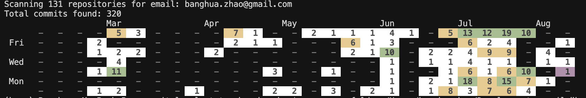

# 🚀 Go Git Local Status

> **Note**: This project is based on the tutorial ["Visualize your local Git contributions with Go"](https://flaviocopes.com/go-git-contributions/) by Flavio Copes. The original tutorial provides a comprehensive guide on building a Git stats analysis CLI tool using Go.

[](https://golang.org/)
[](LICENSE)
[](https://github.com/banghuazhao/go_git_local_status)
[](https://github.com/banghuazhao)

A powerful Go application that analyzes your local Git repositories and generates a beautiful GitHub-style contribution graph showing your coding activity over the last 6 months. Perfect for developers who want to track their local development activity across multiple repositories!

## ✨ Features

- 🔍 **Smart Repository Discovery** - Recursively scans directories for Git repositories
- 📊 **GitHub-Style Visualization** - Beautiful contribution graph with colored cells
- 📅 **6-Month Activity Overview** - Complete view of your coding patterns
- 🎨 **Intelligent Color Coding** - White, yellow, green based on activity levels
- ⚡ **Lightning Fast** - Processes hundreds of repositories efficiently
- 🛡️ **Robust Error Handling** - Gracefully handles problematic repositories
- 🎯 **Email Filtering** - Focus on your specific contributions
- 📱 **Cross-Platform** - Works on macOS, Linux, and Windows

## 🎯 Why Use This Tool?

- **Track Your Progress** - See your coding activity patterns over time
- **Local Development Focus** - Analyze repositories not on GitHub
- **Multiple Repository Support** - Get insights across all your projects
- **Beautiful Output** - GitHub-style graphs in your terminal
- **Privacy First** - All analysis happens locally on your machine

## 🚀 Quick Start

### Prerequisites

- Go 1.24.5 or higher
- Git repositories on your local machine

### Installation

1. **Clone the repository:**
```bash
git clone https://github.com/banghuazhao/go_git_local_status.git
cd go_git_local_status
```

2. **Install dependencies:**
```bash
go mod tidy
```

3. **Run the tool:**
```bash
go run . -folder "/path/to/your/projects" -email "your.email@example.com"
```

## 📊 Example Output



*Example output showing a GitHub-style contribution graph generated from local Git repositories*

## 🎨 Color Legend

- `-` : No commits (gray)
- `1-4` : Light activity (white background)
- `5-9` : Medium activity (yellow background)
- `10+` : High activity (green background)

## ⚙️ Command Line Options

- `-folder string`: Directory to scan for Git repositories
- `-email string`: Email address to filter commits (default: "your@email.com")

## 🔧 How It Works

1. **Repository Discovery**: Recursively scans the specified directory for `.git` folders
2. **Commit Analysis**: For each repository, reads the Git history and filters commits by email
3. **Date Calculation**: Calculates days since each commit and applies offset for proper graph alignment
4. **Graph Generation**: Creates a GitHub-style contribution graph with color-coded cells
5. **Output Display**: Shows the graph with month labels and day-of-week alignment

## 📁 Project Structure

```
go_git_local_status/
├── main.go          # Main entry point and flag parsing
├── scan.go          # Repository discovery and Git folder scanning
├── stats.go         # Commit analysis and graph generation
├── screenshots/     # Example outputs and documentation
├── go.mod           # Go module dependencies
├── go.sum           # Dependency checksums
└── README.md        # This file
```

## 🛠️ Dependencies

- [go-git/go-git/v5](https://github.com/go-git/go-git) - Git repository operations
- Standard Go libraries (flag, fmt, log, os, strings, time)

## 🛡️ Error Handling

The application gracefully handles:
- Empty Git repositories
- Repositories without HEAD references
- Corrupted Git repositories
- Permission errors
- Invalid repository paths

## ⚡ Performance

- Processes multiple repositories efficiently
- Skips problematic repositories without stopping
- Memory-efficient commit iteration
- Fast directory scanning

## 🤝 Contributing

We love contributions! Here's how you can help:

1. ⭐ **Star this repository** if you find it useful
2. 🐛 **Report bugs** by opening an issue
3. 💡 **Suggest features** through issues
4. 🔧 **Submit pull requests** for improvements
5. 📖 **Improve documentation**

### Development Setup

1. Fork the repository
2. Create a feature branch: `git checkout -b feature/amazing-feature`
3. Make your changes
4. Add tests if applicable
5. Commit your changes: `git commit -m 'Add amazing feature'`
6. Push to the branch: `git push origin feature/amazing-feature`
7. Open a Pull Request

## 📄 License

This project is open source and available under the [MIT License](LICENSE).

## 👨‍💻 Author

**Created by [@banghuazhao](https://github.com/banghuazhao)**

- 🔗 **GitHub**: [@banghuazhao](https://github.com/banghuazhao)
- 🚀 **More Projects**: Check out my other repositories for more amazing tools!

## ⭐ Show Your Support

If this project helps you track your development activity, please consider:

- ⭐ **Starring this repository**
- 👥 **Following me on GitHub**
- 🐛 **Reporting bugs or suggesting features**
- 💬 **Sharing with your developer friends**

---

**💡 Pro Tip**: This tool is perfect for developers who work across multiple local repositories and want to visualize their coding patterns, similar to GitHub's contribution graph but for your local development environment.

**🎯 Perfect For**: Software engineers, developers, and anyone who wants to track their local Git activity patterns!
